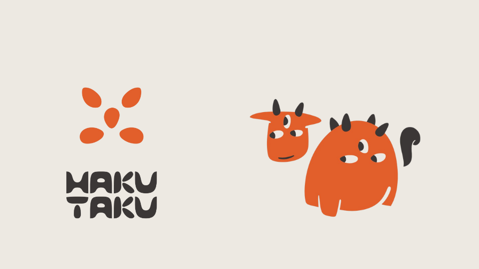
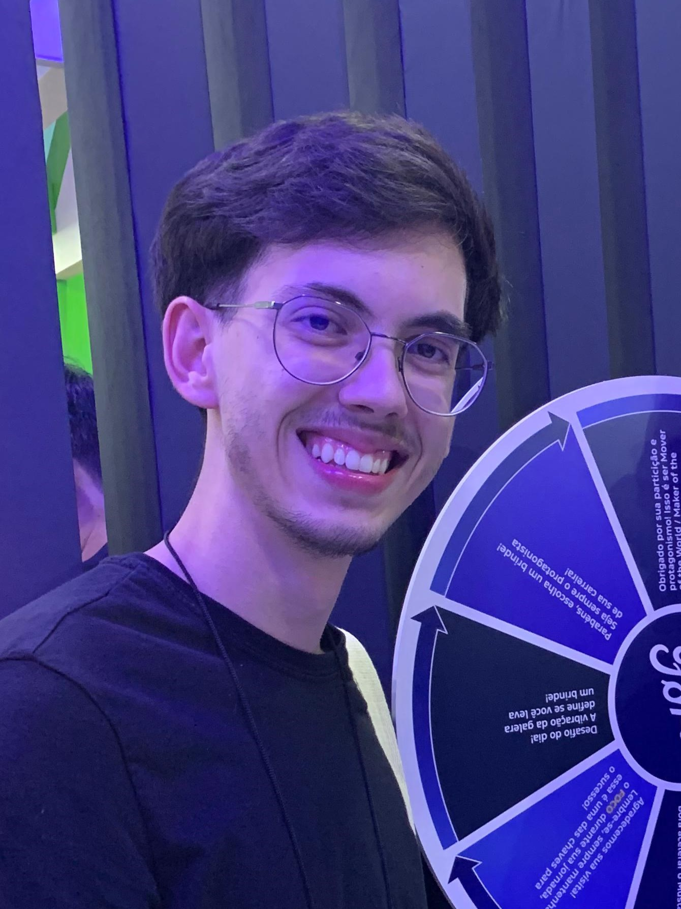
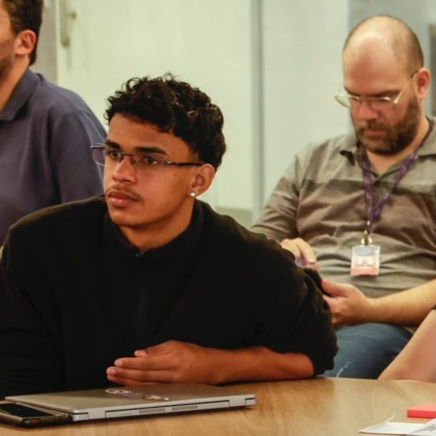

# Stark Bank - AI Revolution Hackathon

## Solução: Hakutaku

## Equipe: Refrescos 🥤🥝
### Integrantes: 

  <table>
    <tr>
      <td align="center"><a href="https://www.linkedin.com/in/davi-abreu-da-silveira/"> <b>Davi Abreu</b></a></td>
      <td align="center"><a href="https://www.linkedin.com/in/gabriela-fichtner/"> <b> Gabriela Fichtner</b></a></td>
      <td align="center"><a href="https://www.linkedin.com/in/raduanmuarrek/"> <b>Raduan Muarrek</b></a></td>
      <td align="center"><a href="https://www.linkedin.com/in/vinicioslugli/"> <b>Vinicios Lugli</b></a></td>
      <td align="center"><a href="https://www.linkedin.com/in/rodrigo-campos-8b70191ab/"> <b>Rodrigo Campos</b></a></td>
    </tr>
  </table>

## Sumário
[1. Extrutura de Pastas](#c1)

[2. Descrição](#c2)

[3. Personas](#c3)

[4. Análise da empresa](#c4)

[5. Análise de dados](#c5)

## 1. Extrutura de Pastas

## 2. Descrição da Hakutaku

&nbsp;&nbsp;&nbsp;&nbsp;&nbsp;&nbsp;A Hakutaku é um assistente inteligente que usa IA para fornecer insights e otimizar o uso de informações no StarkBank, ajudando clientes e colaboradores a economizar tempo com um chatbot que resolve dúvidas sobre APIs e facilita o acesso a dados.

### 2.1 Missão:

&nbsp;&nbsp;&nbsp;&nbsp;&nbsp;&nbsp;Transformar a informação da empresa em ações que impulsionem o sucesso de clientes e colaboradores, promovendo inovação e transparência

##  3. Personas

### 3.1 Colaborador do StarkBank:

**Nome**: Lucas Almeida

**Profissão**: Desenvolvedor

**Descrição**: Lucas trabalha no StarkBank há três anos, e faz parte da equipe de devs do banco. Com formação em Sistemas de Informação, Lucas tem facilidade com tecnologia e é conhecido por resolver problemas complexos e entender as necessidades dos clientes.

**Objetivos:**
- Dar autonomia e otimizar o tempo de implementação da API do StarkBank pelo cliente
- Obter insights que possam ser compartilhados com as áreas de produto e marketing para melhorar a experiência do cliente
- Aumentar o número de produtos que o cliente utiliza do StarkBank

**Dores:**
- Frequentemente precisa interromper operações para responder a dúvidas de clientes sobre a integração da API do Stark Bank
- Sentimento de frustração ao lidar com perguntas recorrentes que poderiam ser evitadas com melhorias no produto ou na comunicação
- Pressão para manter altos níveis de satisfação do cliente em um ambiente dinâmico e com alta demanda
- Desafios para integrar insights de diferentes fontes de dados, criando uma visão coesa das necessidades dos clientes

### 3.2 Dev de empresa cliente

**Nome**: Mariana Costa

**Profissão**: Engenheira de Software

**Descrição**: Mariana é uma Engenheira de Software na VTEX. Ela é conhecida pela sua habilidade em resolver problemas complexos e implementar soluções técnicas robustas.

**Objetivos**:
- Concluir a integração entre os sistemas da VTEX e as APIs do Stark Bank de forma autonoma
- Minimizar o tempo de desenvolvimento, evitando retrabalhos e garantindo a entrega dentro dos prazos
- Garantir a segurança e conformidade das integrações com os padrões exigidos

**Dores:**
- Documentações longas que entregam informações pontuais para ela
- Dúvidas personalizadas em relação à integração da VTEX com o StarkBank, que podem ser sanadas com os desenvolvedores da Stark, mas leva tempo

## 4. Análise da empresa

&nbsp;&nbsp;&nbsp;&nbsp;&nbsp;&nbsp;A Hakutaku é uma solução SaaS (Software as a Service) voltada para o mercado B2B, atendendo especialmente instituições financeiras, empresas de tecnologia e organizações que oferecem infraestrutura tecnológica de alta complexidade. Nossa proposta é ajudar empresas que lidam com grandes volumes de dados e necessitam de rapidez e precisão no suporte ao cliente, transformando o atendimento e o acesso a informações em uma vantagem competitiva, gerando insights visando a rampagem de clientes e melhoria de produtos para seus clientes.

**Diferencial:**

&nbsp;&nbsp;&nbsp;&nbsp;&nbsp;&nbsp;Os dados qualitativos e as dores (dados) coletadas pelo chatbot, que são baseados em histórico, quando associados é possível identificar padrões e tendências que podem ser usados para aprimorar a experiência do cliente e oferecer mais serviços, já que boa parte da informação da potencialidade dos clientes não são tão profundos atualmente na StarkBank, mas são de grande valor pois podem afetar positivamente a rampagem dos clientes.

## 5. Análise de Dados

&nbsp;&nbsp;&nbsp;&nbsp;&nbsp;&nbsp;Utilizando os dados fornecidos pela equipe da Stark Bank, o arquivo corporate_purchase.csv foi analisado para identificar características relevantes dos clientes. Foram examinados padrões de compra, como o número de transações, valores, categorias dos produtos e datas, com o objetivo de fornecer essas informações como input para o chatbot. Inicialmente, o software Looker Studio foi empregado para explorar os dados por meio de gráficos e análises estatísticas. 

&nbsp;&nbsp;&nbsp;&nbsp;&nbsp;&nbsp;Em seguida, os dados foram processados no Jupyter Notebook, onde, com o uso da biblioteca Pandas em Python, foram extraídas informações detalhadas de nove dimensões distintas, como o total de transações por categoria, transações por status e status por tipo de produto, entre outros. Após essa extração, as informações foram preparadas e incorporadas como input ao modelo.

